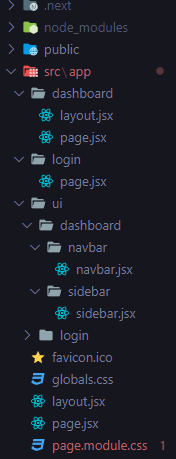

# Accreting my Next.js journey

Trying to understand the project, because I do not 100% get what he's trying to do, so I have to fill in the gaps and keep note on what he does.

### Recommended folder structure from Docs's "Apparently" That means everything he's doing is 100% by the book and I should follow this file structure, but he also taught me the file structure in his previous 5-hour project and it was different, and it didn't contain UI nor did we have to import global CSS from UI.

## Hates about this Tut

- He create to much files outright. making teh dir messy right of the bat.

## Odd File setup



- Creating a comp file and within that file creating a layout is odd, but let's see what he does.
- I have never heard of a file being named UI and being placed in the app route as if it were a page, but it's not; it holds another dashboard file and navbar, I think it's because of how the overall dashboard file is set up.

## Naming convention

- Naming convention is weird, but I think it's great. In my last project, I had a weird error when deploying in Vercel because of some weird naming trace issue, I think so I renamed my /Hero/Hero.js to /Hero/HeroPage.jsx.

## Must be Page.jsx

If it's not page.js then the code will not work.
However, the const export can be anything but it needs a capital word, common convention states Filename with a Capital Word + "page" in the end.

## Enforcing: Any route page need to be a page.jsx even if its a children

even if teg url looks like /dashboard/products at teh end of tehy day, dashboard and products are named page.jsx but the export inside and the folder route name is dashboard or products, howvere the jsx file is called page.jsx as its a page for teh folder route, this is not common convetion this is objective, menaing teh page wont render if the jsx file name is not Page.jsx

## Taking {{children}} without Wrapping

If you have a file structure where both the page and layout components reside in the same folder, and the layout component is designed to wrap its children, any page component imported and rendered within that layout component will automatically become a child of the layout.

## CSS conventions

```js
//  when naming teh file moduile, it spetres it form the css and you can name things like contrainer in serveal css modules without it conflicting.

import styles from "./sidebar.module.css"; // here a the import dir and name

<div className={styles.container}>Sidebar</div>; // indavuialy impiorting the style as if it were a basic var import
```

## CSS naming conventions

its allways, name of file . "module" . css

## Folder Placement conventions

lib folder is inside of app, in the last video it wasnt, lib was outisde of app and it also had a componnets folder rather then a ui folder

## UI folder in App Router replaces the Components folder convention

The UI folder, as you described it, seems to serve as a container for all the UI elements, similar to a component folder in basic React setups. It's a common practice to organize UI-related components and styles separately from other parts of the application for better modularity and maintainability. This separation helps in managing and scaling the application as it grows, making it easier to locate and update UI elements independently.

## Maping Over ObjArry For Links

cool use of array obj, but i alredy know this

````js const menuItems = [
       {
         title: "Pages",
         list: [
           {
             title: "Dashboard",
             path: "/dashboard",
             icon: <MdDashboard />,
           },
           {
             title: "Users",
             path: "/dashboard/users",
             icon: <MdSupervisedUserCircle />,
           }, ...


          // Double Maping of MenuItems and i destructured it to make it more readable

 return (
   <div className={styles.container}>
     {menuItems.map(({ title, list }) => (
       <li key={title}>
         <span className={styles.cat} >{title}</span>
         {list.map(({ title, path, icon}) => (
           <MenuLink key={title} title={title}  path={path} item={item} icon={icon}  />
         ))}
       </li>

     ))}
   </div>
 );
};

//  MenuLink is taking all teh props

const MenuLink = ({ title, path, icon}) => {


```
````

## Simple Path Name Access

```js
import { usePathname } from "next/navigation"; // next import

const pathname = usePathname(); //  require "use Client"

console.log(pathname); // basically, i am able to access the path name ( the url ).

//  Log result dashboard/products

<div className={styles.container}>{pathname.split("/").pop}</div>;
// retuns only the "products" from  dashboard/products
```

## Active Classname link

```js

 <Link className={` ${styles.container} ${pathname === path && "active"}`} href={path}>


```

## Charts

i have laready delt with recharts, because i have used it preveionly in trastcion project, with responsive and dyanimciu data not hard coded like prested in this project

## using and Naming Slugs

The square brackets around the folder name, e.g., [slug], tell Next.js that this is a dynamic route, and the content inside the brackets will be used as the route parameter. This allows you to create pages that can handle different URLs or "slugs" without having to define the routes manually. you can name the dynamic parameter inside the square brackets anything you want, such as [formId], [productSlug], [username], [slug] etc.

## Password Issue

every time you wnan use mongo create a new porject, thats not inveoled in yoru last project. when creating a a new project your please est a password, you password is NOT bhattaraianjesh123 !!!!!!!!!!!!

I made a big mistake by not creating and establishing a password, and I thought it would be the same as 'bhattaraianjesh123'.


## Fetcthing the data form Mongo collection's 

```js

// data.js

import { User } from "./models"; 
import { connectToDB } from "./utils";

export const fetchUsers = async () => {
  try {
    connectToDB();

    const users = await User.find();
    return users;
  } catch (err) {
    console.log(err);
    throw new Error(Error);
  }
};


// UsersPage.jsx
 
import { fetchUsers } from "@/app/lib/data";
 
const UsersPage = async () => {
  // a chldiren element within dashbaord app route
  const users = await fetchUsers(); 
  console.log(users);


// the console log output


  {
    _id: new ObjectId('661c9261058876f71d5949c7'),
    username: 'ike',
    email: 'ike@email.com',
    password: '123456',
    img: 'https://images.pexels.com/photos/20726113/pexels-photo-20726113/free-photo-of-a-view-of-the-city-of-siena-italy.jpeg?auto=compress&cs=tinysrgb&w=1260&h=750&dpr=1',
    isAdmin: false,
    isActive: true
  },
  {
    _id: new ObjectId('661c927c058876f71d5949c8'),
    username: 'whyomi',
    email: 'whyomi@email.com',
    password: '123456',
    img: 'https://images.pexels.com/photos/20726113/pexels-photo-20726113/free-photo-of-a-view-of-the-city-of-siena-italy.jpeg?auto=compress&cs=tinysrgb&w=1260&h=750&dpr=1',
    isAdmin: false,
    isActive: true
  }
]


```

## Mapping Fetch directly 

```js
  const users = await fetchUsers();

// ...


{users.map((user) => {
            return (
              <tr key={user.id}>
                <td>
                </td>
                </tr>
            )})}
```